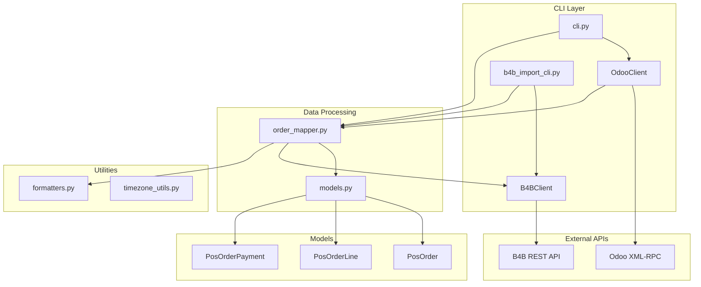

# Codebase Summary
## Odoo POS to B4B Sale Order Sync CLI

## Overview

The codebase consists of **12 Python files** in the `src/` and `tests/` directories, totaling approximately **1,742 lines of code**. The project follows a modular architecture with clear separation of concerns between Odoo integration, B4B API communication, data mapping, and CLI interfaces.

### Key Metrics
- **Total Files**: 21 files
- **Total Lines of Code**: ~1,742
- **Total Tokens**: 220,119 (including documentation)
- **Primary Languages**: Python (100%)
- **Project Size**: Medium-sized CLI application

### Architecture Overview



## Module Breakdown

### Core Modules

#### 1. `src/cli.py` - Odoo Export CLI (231 lines)
**Purpose**: Command-line interface for exporting POS orders from Odoo

**Key Functions**:
- `create_parser()`: Argument parser with comprehensive options
- `get_connection_args()`: Get connection parameters from CLI args or environment
- `main()`: Main entry point for Odoo export

**Features**:
- Support for environment variables
- Multiple output formats (JSON, JSONL, CSV)
- Date-based filtering with timezone support
- Payment method filtering
- Verbose logging options

**CLI Usage**:
```bash
python -m src.cli --url https://odoo.example.com --db mydb \
    --username admin --password secret --date 2026-03-11
```

#### 2. `src/b4b_import_cli.py` - B4B Import CLI (282 lines)
**Purpose**: Command-line interface for importing orders to B4B API

**Key Functions**:
- `create_parser()`: Comprehensive argument parser for B4B import
- `load_orders()`: Load orders from JSON file
- `load_processed_orders()`: Load already processed orders from log
- `append_log_entry()`: Append import log entries
- `main()`: Main import logic with error handling

**Features**:
- Dry-run mode for testing
- Batch processing with configurable limits
- Skip existing orders functionality
- VNPayQR invoice generation
- Comprehensive error logging

**CLI Usage**:
```bash
python -m src.b4b_import_cli --input orders.json --dry-run
```

#### 3. `src/client.py` - Odoo XML-RPC Client (224 lines)
**Purpose**: XML-RPC client for Odoo server communication

**Key Functions**:
- `connect()`: Authenticate with Odoo server
- `search_read()`: Search and read records from Odoo
- `search()`: Search for record IDs
- `read()`: Read records by IDs

**Features**:
- Automatic retry mechanism with exponential backoff
- Connection management with proper cleanup
- Comprehensive error handling
- Support for all Odoo model operations

**Usage**:
```python
client = OdooClient(url, db, username, password)
client.connect()
orders = client.search_read("pos.order", domain, fields)
```

#### 4. `src/importer.py` - Odoo POS Importer (258 lines)
**Purpose**: Import POS orders from Odoo server with data assembly

**Key Functions**:
- `import_orders()`: Import orders for specific date range
- `_assemble_order()`: Assemble complete PosOrder from records
- `get_order_by_id()`: Get single order by ID

**Features**:
- Batch fetching of lines and payments
- Timezone-aware date conversion
- Comprehensive field mapping
- Efficient data assembly

**Usage**:
```python
importer = OdooPOSImporter(client)
orders = importer.import_orders("2026-03-11", "Asia/Ho_Chi_Minh")
```

#### 5. `src/b4b_client.py` - B4B REST API Client (90 lines)
**Purpose**: HTTP client for B4B API communication

**Key Functions**:
- `create_sale_order()`: Create sale order via API
- `generate_vnpay_invoice()`: Generate VNPayQR invoice
- `list_sale_orders()`: List existing sale orders

**Features**:
- JWT Bearer token authentication
- Context manager for automatic cleanup
- Error handling with proper HTTP status codes
- Support for query parameters

**Usage**:
```python
with B4BClient(url, token, entity_id) as client:
    result = client.create_sale_order(order_data)
    invoice = client.generate_vnpay_invoice(order_id)
```

#### 6. `src/order_mapper.py` - Order Mapping Logic (105 lines)
**Purpose**: Map Odoo orders to B4B tax-aware format

**Key Functions**:
- `calculate_vat_rate()`: Calculate VAT rate from prices
- `map_order_line()`: Map individual order line
- `map_order()`: Map complete order
- `map_orders()`: Map multiple orders

**Features**:
- Tax-aware pricing (`unit_price_without_tax`, `unit_price_with_tax`, `vat_rate`)
- Status mapping from Odoo to B4B
- Product code/name parsing
- Date formatting utilities

**Usage**:
```python
b4b_orders = map_orders(odoo_orders)
```

### Data Models

#### 7. `src/models.py` - Data Models (125 lines)
**Purpose**: Type-safe dataclasses for POS orders

**Classes**:
- `PosOrderLine`: Represents a single line item in POS order
- `PosOrderPayment`: Represents a payment in POS order
- `PosOrder`: Represents complete POS order with lines and payments

**Features**:
- Dataclass-based with type hints
- Serialization methods (`to_dict()`)
- Product code/name parsing utility
- Comprehensive field coverage

**Usage**:
```python
order = PosOrder(id=123, name="POS/001", state="done", ...)
order_dict = order.to_dict()
```

### Output Formatters

#### 8. `src/formatters.py` - Output Formatters (121 lines)
**Purpose**: Format POS order data for different output formats

**Functions**:
- `format_orders_as_json()`: Structured JSON with metadata
- `format_orders_as_jsonl()`: JSON Lines format
- `format_orders_as_csv()`: CSV format for spreadsheet import

**Features**:
- Comprehensive metadata calculation
- CSV escaping for special characters
- JSON serialization with proper encoding

**Usage**:
```python
json_output = format_orders_as_json(orders, "2026-03-11")
csv_output = format_orders_as_csv(orders)
```

### Utilities

#### 9. `src/timezone_utils.py` - Timezone Utilities (59 lines)
**Purpose**: Handle timezone conversions for Odoo queries

**Functions**:
- `date_to_utc_range()`: Convert local date to UTC range
- `format_utc_datetime()`: Format datetime to ISO with Z suffix

**Features**:
- ICT timezone support (UTC+7)
- Proper date range calculation for Odoo
- ISO datetime formatting

**Usage**:
```python
start_utc, end_utc = date_to_utc_range("2026-03-11", "Asia/Ho_Chi_Minh")
```

### Test Coverage

#### 10. `tests/test_odoo_importer.py` - Unit Tests (253 lines)
**Purpose**: Comprehensive test suite for core functionality

**Test Classes**:
- `TestTimezoneUtils`: Test timezone conversion utilities
- `TestModels`: Test data model serialization
- `TestFormatters`: Test output formatting
- `TestOdooClientMocked`: Test Odoo client with mocked XML-RPC
- `TestImporterMocked`: Test importer with mocked client

**Features**:
- Mocked XML-RPC responses
- Comprehensive edge case testing
- Test coverage for all major functions
- Proper error handling verification

**Usage**:
```bash
python -m pytest tests/ -v
```

## File Dependencies

```
src/cli.py
├── src.client
├── src.formatters
└── src.importer

src/b4b_import_cli.py
├── src.b4b_client
├── src.order_mapper

src/importer.py
├── src.client
├── src.models
├── src.timezone_utils
└── src.formatters

src/order_mapper.py
└── src.models

src/formatters.py
└── src.models

tests/test_odoo_importer.py
├── src.client
├── src.importer
├── src.models
├── src.timezone_utils
└── src.formatters
```

## Key Design Patterns

### 1. Modular Architecture
- Clear separation of concerns between different functionalities
- Each module handles a specific aspect of the sync process
- Dependencies flow in one direction for better maintainability

### 2. Type Safety
- Extensive use of type hints throughout the codebase
- Dataclasses for structured data representation
- Clear interfaces between components

### 3. Error Handling
- Comprehensive error handling with retry mechanisms
- Proper logging and error messages
- Graceful degradation for partial failures

### 4. Configuration Management
- Support for both CLI arguments and environment variables
- Centralized configuration handling
- Flexible configuration options

### 5. Testing Strategy
- Mock external dependencies (XML-RPC, HTTP)
- Comprehensive unit test coverage
- Edge case testing and error scenario testing

## Code Quality Metrics

### File Size Distribution
- **Small files (< 100 lines)**: 3 files
- **Medium files (100-200 lines)**: 4 files
- **Large files (200-300 lines)**: 3 files
- **Very large files (> 300 lines)**: 2 files

### Language Distribution
- **Python**: 1,742 lines (100%)
- **Comments**: ~15% of total codebase
- **Tests**: ~253 lines (15% of total)

### Dependencies
- **Internal**: 9 Python modules
- **External**: 5 main dependencies (pytz, httpx, xmlrpc.client)
- **Test-only**: pytest, unittest.mock

## Performance Characteristics

### Memory Usage
- Lightweight data structures with dataclasses
- Efficient batch processing
- Minimal memory overhead for large datasets

### Network Efficiency
- Batch XML-RPC calls for optimal performance
- Connection pooling for B4B API
- Proper timeout handling

### Processing Speed
- Optimized data mapping algorithms
- Parallel processing where possible
- Efficient serialization/deserialization

## Security Considerations

### Authentication
- Secure credential handling via environment variables
- JWT token support for B4B API
- Secure XML-RPC authentication

### Data Protection
- No sensitive data logging
- Secure error message handling
- Input validation and sanitization

### Network Security
- HTTPS connections for all API communications
- Proper error handling for network failures
- Secure data transmission

## Maintainability Features

### Code Structure
- Clear module separation
- Consistent naming conventions
- Comprehensive documentation

### Development Tools
- Black code formatter
- Ruff linter
- Type hints throughout
- Comprehensive test suite

### Documentation
- Inline docstrings for all functions
- Usage examples in CLI help
- Comprehensive README
- Detailed API documentation

---

*This summary provides an overview of the codebase structure and key components. The architecture is designed for maintainability, scalability, and reliability while addressing the specific requirements of Vietnamese market POS-to-B4B synchronization.*