# System Architecture
## Odoo POS to B4B Sale Order Sync CLI

## Overview

The Odoo POS to B4B Sale Order Sync CLI follows a modular, layered architecture that separates concerns between external system integration, data processing, and user interface layers. This design ensures maintainability, testability, and scalability while handling the complexities of Vietnamese market tax requirements and B2B synchronization.

## Architecture Diagram

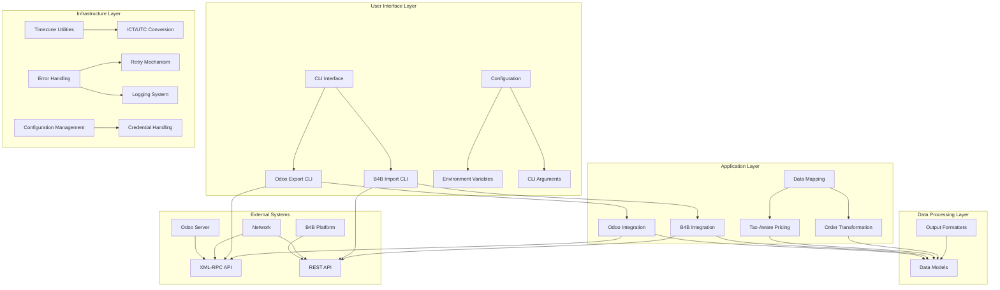

## Component Architecture

### 1. CLI Layer
**Purpose**: Provide user interface and command-line interaction

**Components**:
- **Odoo Export CLI (`src/cli.py`)**: Handles order export from Odoo
- **B4B Import CLI (`src/b4b_import_cli.py`)**: Handles order import to B4B
- **Configuration Management**: Supports both CLI args and environment variables

**Key Features**:
- Argument parsing with comprehensive options
- Environment variable fallback
- Progress indication and error reporting
- Multiple output format support

### 2. Integration Layer
**Purpose**: Handle communication with external systems

**Components**:
- **Odoo XML-RPC Client (`src/client.py`)**:
  - XML-RPC API communication
  - Authentication and session management
  - Retry mechanism with exponential backoff
  - Error handling and logging

- **B4B REST API Client (`src/b4b_client.py`)**:
  - HTTP-based REST API communication
  - JWT token authentication
  - Context manager for resource cleanup
  - Proper HTTP status code handling

### 3. Data Processing Layer
**Purpose**: Transform and process order data between systems

**Components**:
- **Data Models (`src/models.py`)**:
  - Type-safe dataclasses for POS orders
  - Product line and payment models
  - Serialization and deserialization methods

- **Order Mapper (`src/order_mapper.py`)**:
  - Tax-aware pricing calculations
  - Odoo to B4B field mapping
  - VAT rate calculations
  - Status and date transformations

- **Output Formatters (`src/formatters.py`)**:
  - JSON, JSONL, CSV output formats
  - Metadata calculation
  - CSV escaping and formatting

### 4. Utilities Layer
**Purpose**: Provide supporting functionality for the application

**Components**:
- **Timezone Utilities (`src/timezone_utils.py`)**:
  - ICT to UTC conversion for Odoo queries
  - Date range calculations
  - ISO datetime formatting

- **Error Handling System**:
  - Custom exception hierarchy
  - Retry mechanisms
  - Comprehensive logging
  - Graceful degradation

- **Configuration Management**:
  - Environment variable handling
  - Credential management
  - Validation and fallback logic

## Data Flow Architecture

### Primary Sync Flow

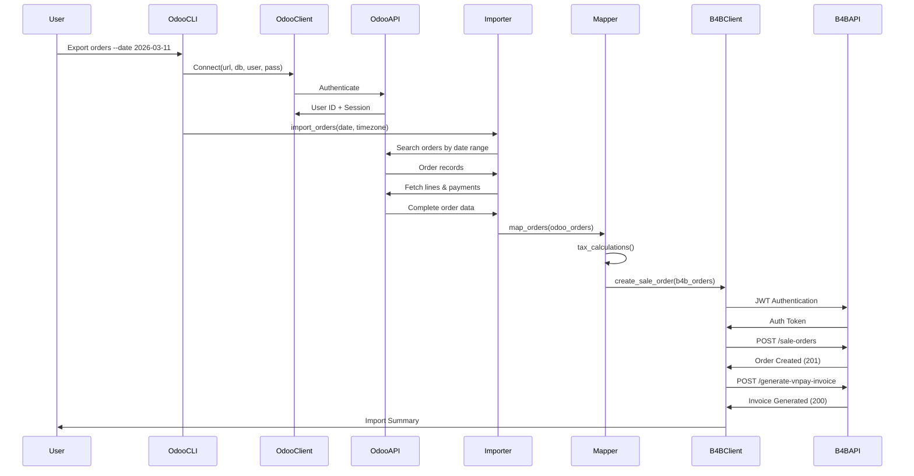

### Tax-Aware Data Transformation

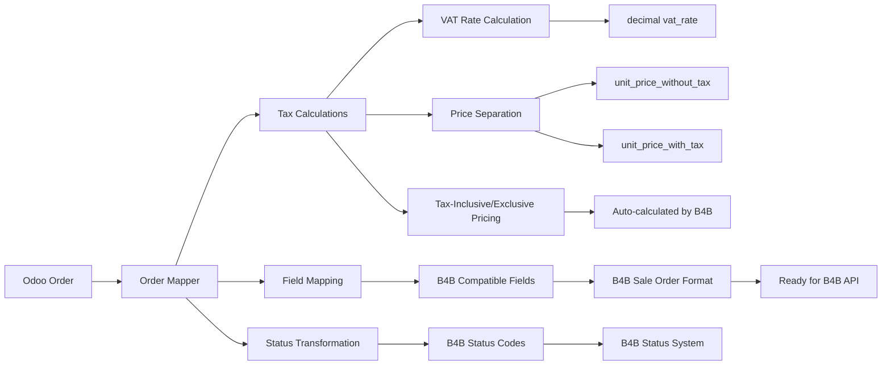

## Error Handling Architecture

### Error Types and Handling

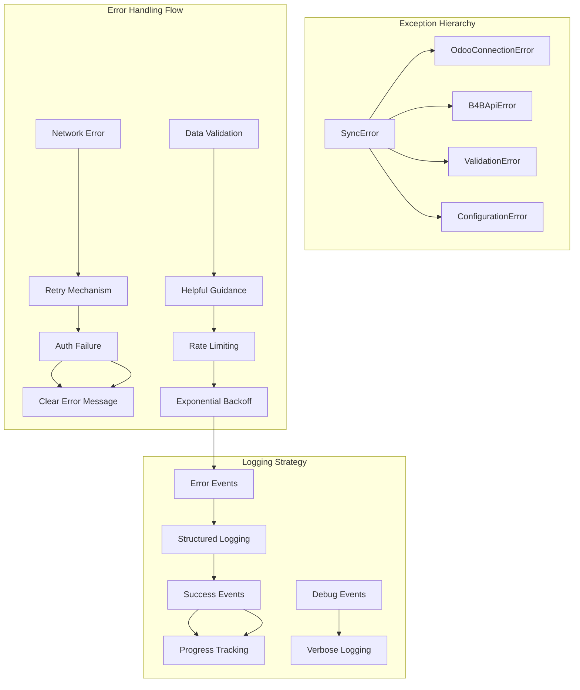

## Performance Architecture

### Batch Processing Pattern

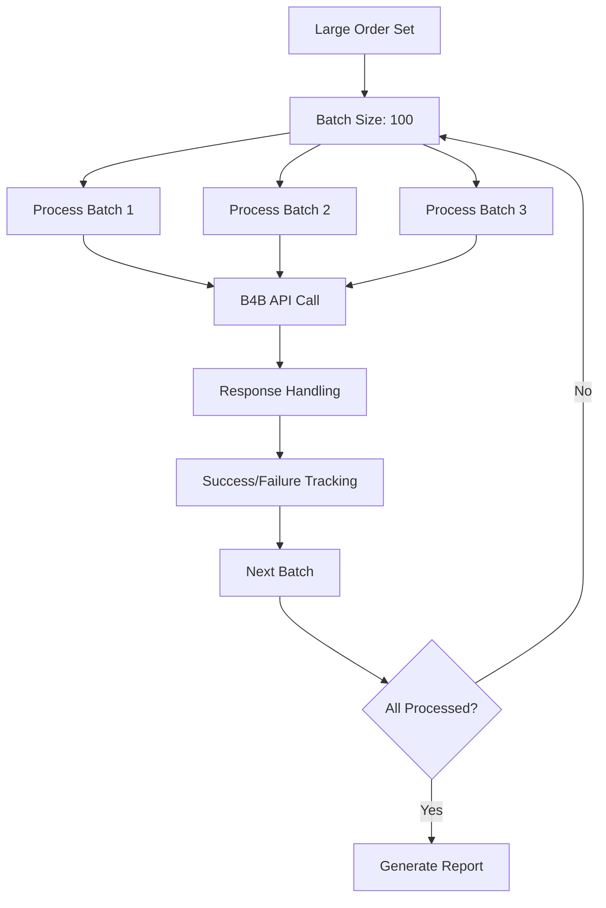

### Memory Management Strategy

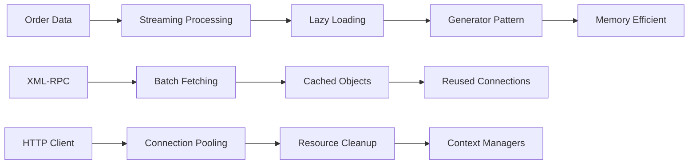

## Security Architecture

### Security Layers

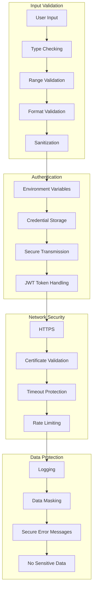

## Deployment Architecture

### Local Development Environment

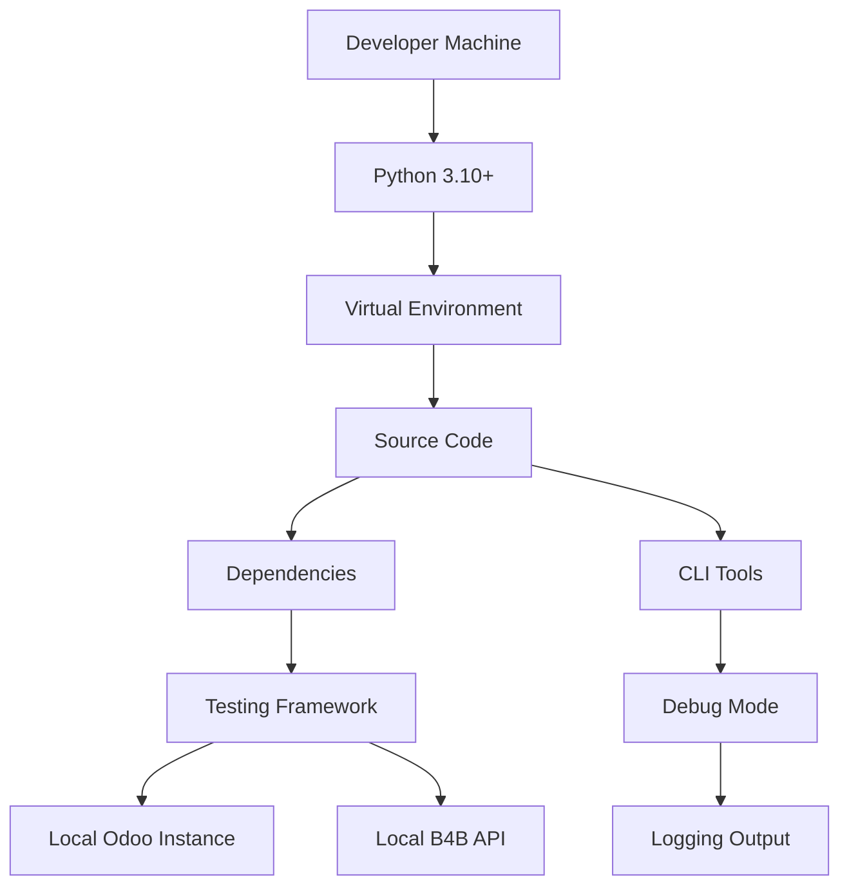

### Production Deployment

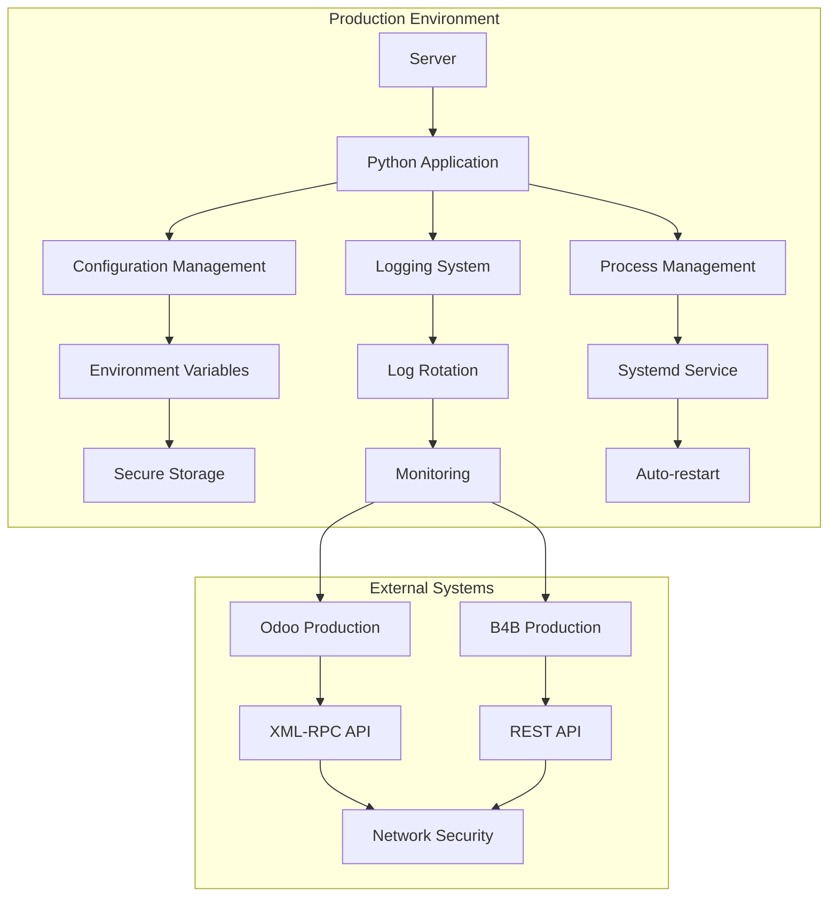

## Monitoring and Observability

### Logging Architecture

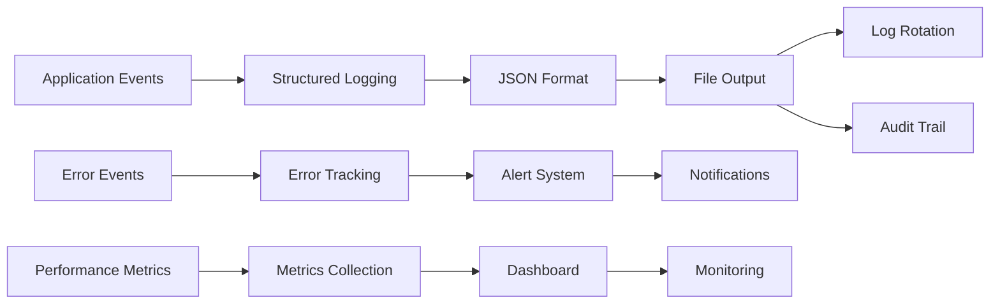

### Health Checks

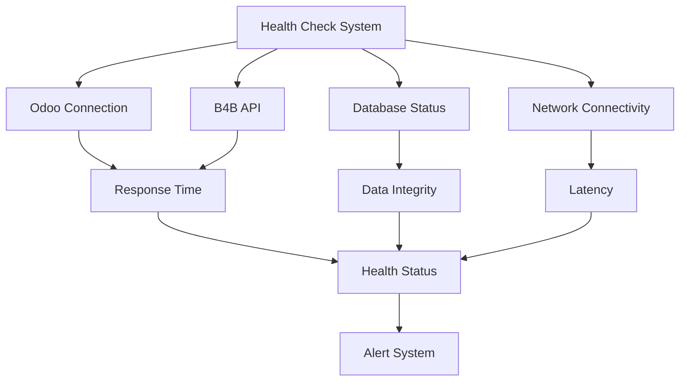

## Scaling Considerations

### Horizontal Scaling

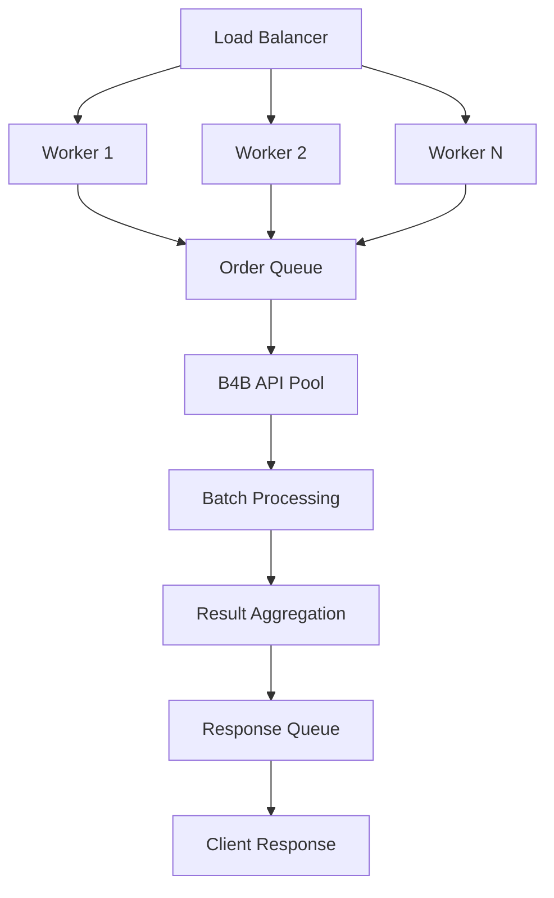

### Performance Optimization

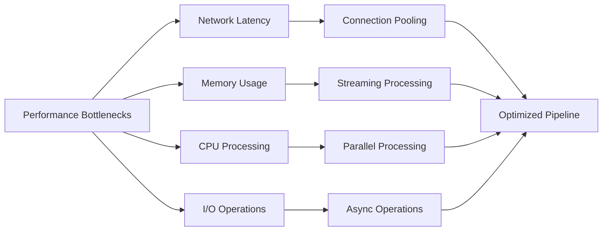

## Technology Stack

### Core Technologies
- **Python 3.10+**: Runtime environment
- **Type Hints**: Static type checking
- **Dataclasses**: Type-safe data structures
- **XML-RPC Client**: Odoo communication
- **HTTPX**: B4B API communication
- **Pytz**: Timezone handling

### Development Tools
- **Black**: Code formatting
- **Ruff**: Linting and formatting
- **Pytest**: Testing framework
- **Mypy**: Type checking
- **Git**: Version control

### External Dependencies
- **Odoo 14+**: XML-RPC API server
- **B4B Platform**: REST API endpoint
- **Network**: HTTPS connectivity
- **Storage**: File system for logging

---

*This architecture documentation provides a comprehensive overview of the system's design and implementation. The architecture is designed to be flexible, maintainable, and scalable while addressing the specific requirements of Vietnamese market POS-to-B4B synchronization.*